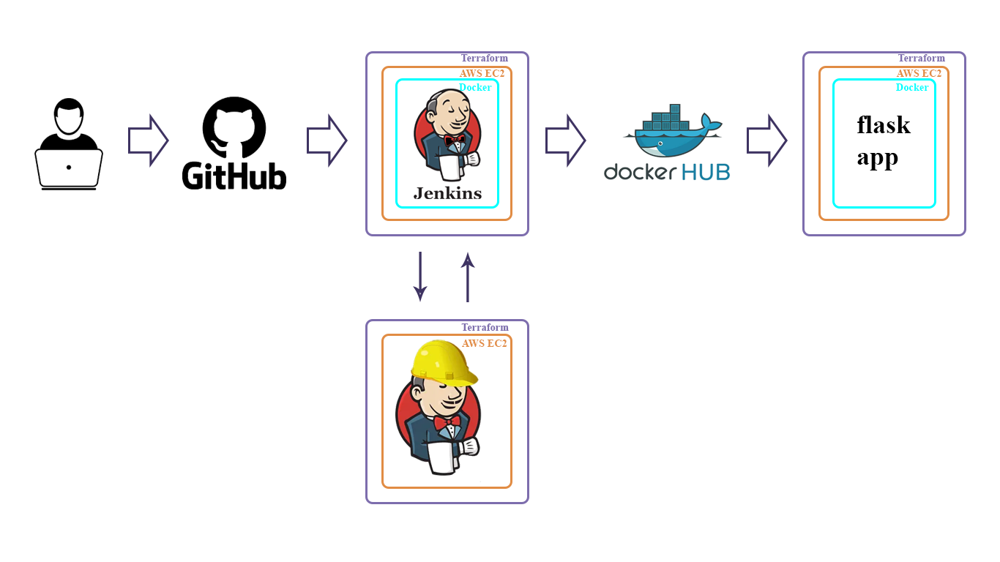

# This is a simple CI-CD using Terraform and Jenkins


### for run you need:

1 installed terraform and git

2 clone this repository
```
git clone https://github.com/612284/Kh-071-01-DevOps-Demo-1.git
```
3 enter your credentials in the terraform.tfvars file

```
# come up with future keys from Jenkins
jenkins_login         = "admin"
jenkins_pass          = "XXXXXXXXXXXXX "
#Docker Hub cred
docker_hub_login      = "XXXXXXX"
docker_hub_password   = "XXXXXXX-XXXX-XXXXX-XXXXXX-XXXXXXXXX"
docker_hub_repo       = "XXXXX/XXXXXXXXXXX"
# keys from EC2 instance in the corresponding region, you need to do it in advance
worker_user           = "ubuntu"
worker_id_rsa         = "/pach/to/id_rsa "
#Git Hub token
git_hub_token         = "ghp_XXXXXXXXXXXXXXXXXXXXXXXXXXXXX"
git_hub_repo_app      = "https://github.com/612284/flask-app.git"
git_hub_repo_pipeline = "https://github.com/612284/test-pipeline.git"
aws_elastic_ip        = "XXX.XXX.XXX.XXX"
```
4 to add AWS credentials for example create 2 files

~/.aws/credentials
```
[default]
aws_access_key_id = your_access_key_id
aws_secret_access_key = your_secret_access_key
```
~/.aws/config
```
[default]
region = your_aws_region
```

or run in terminal
```
export AWS_ACCESS_KEY_ID=your_access_key_id
export AWS_SECRET_ACCESS_KEY=your_secret_access_key
export AWS_REGION=your_aws_region
```


5 run Teppaform
```
terraform init
terraform plan
terraform apply
```


Go to Jenkins and enjoy the work


We go to Prod and check the page


